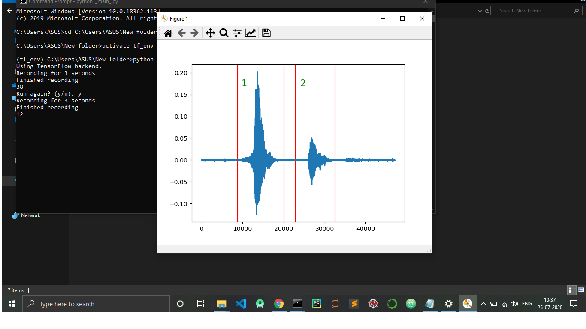

# Spoken number detection

The repository contains all the files needed to run the Number detection model-

  - "_main _.py" -> Main file to run the number detection algorithm. 
  - "util .py" -> Contains the utility functions used to Filter the input sound file
  - Notebooks -> All the notebooks used for arriving at the final code.


You can:
  - Speak the number (2 digit form) in a time window of 3 seconds.
  - 2 digit logic can be easily adapted to higher order numbers.
  - The time window(3 seconds) can be easily changed to any other time window for testing.

### Model

Preprocessing is done on the raw audio file(16000Hz). It is converted to a MFCC feature map(20X40 images). We train a 2D-CNN model on the training dataset(Tensorflow speech recognition dataset). 

* Training accuracy- 98.8%
* Validation accuracy - 94.00%
* Link to the dataset- https://www.kaggle.com/c/tensorflow-speech-recognition-challenge

### Environment setup

The number classification Algorithm need PYTHON 3.6.0 to run with following library dependency-

- Tensorflow(Version: 2.1.0)
- Keras(Version: 2.3.1)
- PyAudio(Version: 0.2.11)
- Librosa(Version: 0.7.2)
- Matplotlib(Version: 3.2.2)

To run the code-
```sh
$ cd Spoken-Digit-Recognization
$ python _main_.py
```

For running in conda virtual environment-

```sh
$ activate tf_env #tf_env(name of virtual env)
$ cd Spoken-Digit-Recognization
$ python _main_.py
```
